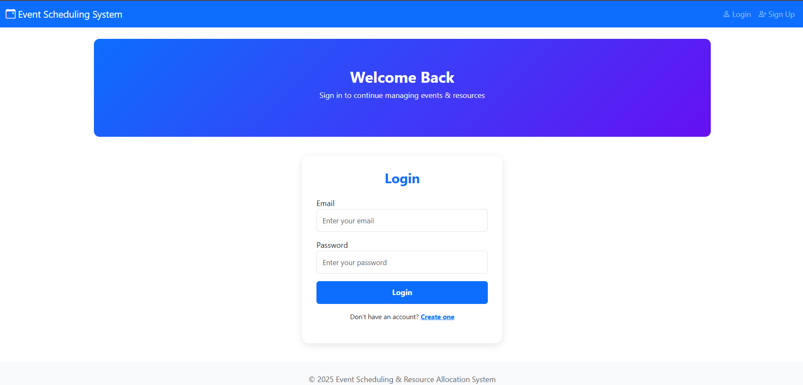
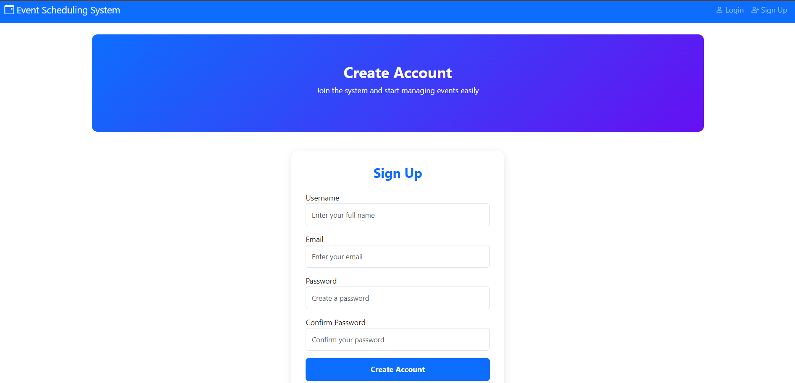
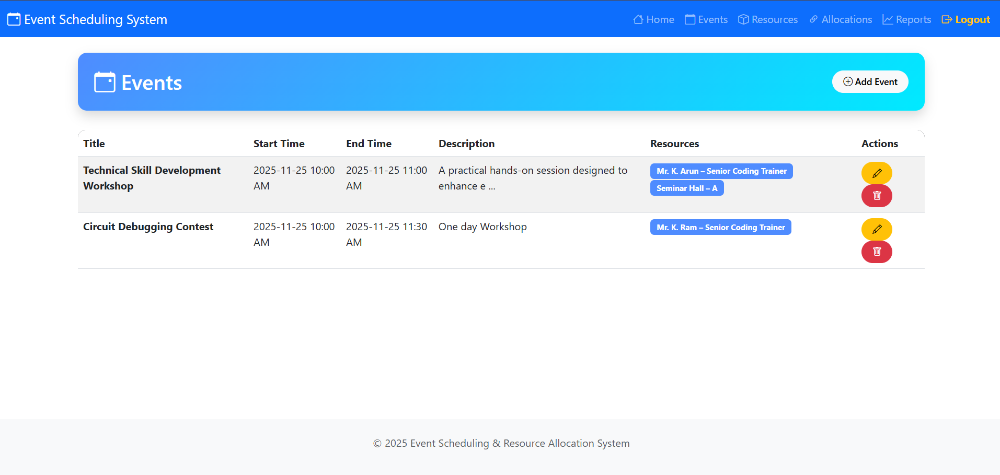
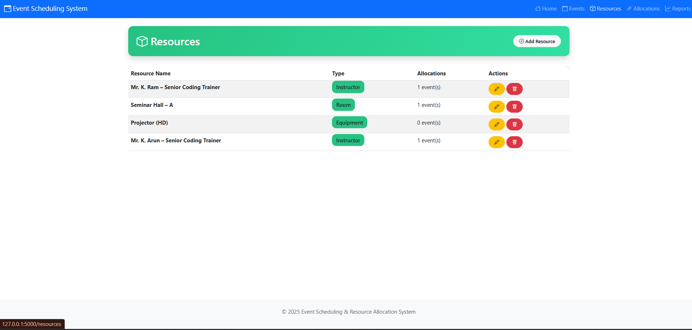
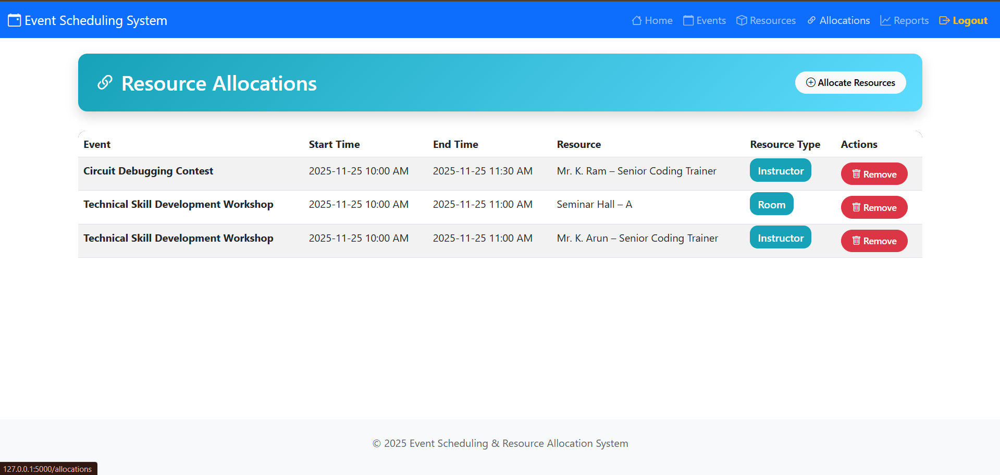
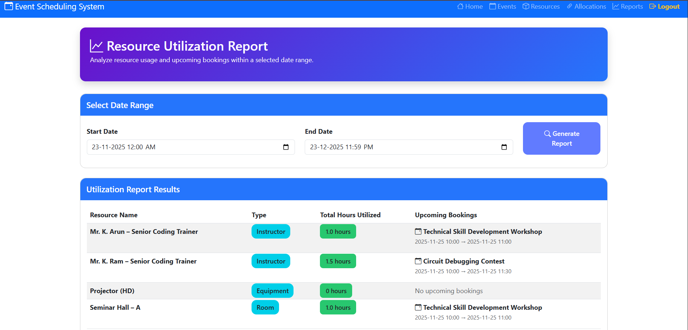
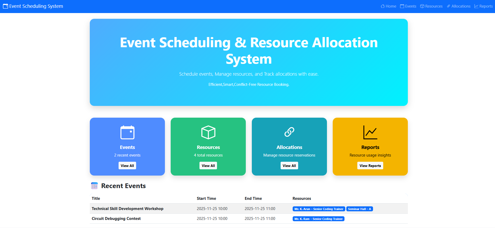

# Event Scheduling & Resource Allocation System

A complete Flask-based web application for managing events, resources, allocations, and preventing double bookings.

## Screenshots

### Login

### Sign Up


### Events


### Resources


### Allocation


### Reports


## Features

- User authentication (signup/login)
- Event management
- Resource management
- Resource allocation
- Conflict detection
- Utilization report
- Bootstrap UI

## Tech Stack

- Flask
- MySQL (PyMySQL)
- WTForms + Flask-WTF
- Bootstrap 5
- Jinja2 templates

## Project Structure

```
EventHandler/
│── app.py
│── forms.py
│── templates/
│── requirements.txt
│── README.md
└── images/
```

## Installation

```sh
pip install -r requirements.txt
python app.py
```

## Conflict Detection Logic

```
(start_time < existing_end) AND (end_time > existing_start)
```
## 🎥 Demo Video (Google Drive)

Click the thumbnail below to watch the screen recording:

[](https://drive.google.com/file/d/1Qa28WZKW6ZDHmhPJGGEwdHnUVprVqS2f/view?usp=drive_link )

## Author
- Developed By Agnees Murali M

